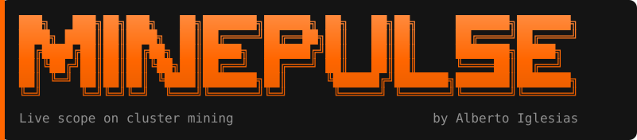

<p align="center">
  
</p>

<p align="center">
  <b>A live terminal scope for the Monero miner running in your cluster.</b><br/>
  Per-node hashrate, threads, shares and pool status; the miner's CPU versus each node's free CPU over time; and pool-side earnings — refreshing until you quit. Read-only, always.
</p>

<p align="center">
  <a href="https://github.com/docked-titan-foundation/minepulse/actions/workflows/pipeline.yml"></a>
  
  
  <a href="https://www.gnu.org/licenses/gpl-3.0"></a>
</p>

> [!NOTE]
> Built with [GitHub Spec Kit](https://github.com/github/spec-kit): the project is
> governed by a [constitution](.specify/memory/constitution.md), and the feature is
> specified in [`specs/001-cluster-mining-scope/`](specs/001-cluster-mining-scope/).

---

## What it shows

`minepulse` watches the [`monero-idle-miner`](https://github.com/docked-titan-foundation/monero-idle-miner)
DaemonSet and answers, continuously, three questions:

1. **Is every node mining, and how fast?** Per-node hashrate, active/total threads,
   accepted/rejected shares, and pool connection — including a loud flag if a miner
   has silently fallen back to XMRig's **donate pool** instead of yours.
2. **Is it really only using *idle* CPU?** Per-node miner-CPU vs node free-CPU, with a
   session **sparkline** so you can watch it take spare cycles and hand them back when
   real workloads arrive.
3. **Is it earning anything?** Pool-side reported hashrate, amount due, and total paid.

It never changes anything it observes — only reads (`get`/`list`/`watch`, `pods/log`,
`pods/proxy`, and metrics).

## Install

**Install script** (Linux/macOS, no toolchain — fetches the signed binary from Releases and verifies its checksum):

```bash
curl -fsSL https://raw.githubusercontent.com/docked-titan-foundation/minepulse/main/install.sh | sh
```

Pin a version or change the target dir with env vars: `VERSION=v1.0.0 BINDIR=~/.local/bin sh -c "$(curl -fsSL …/install.sh)"`.

**Other options:**

```bash
go install github.com/docked-titan-foundation/minepulse@latest        # needs a Go toolchain
docker run --rm ghcr.io/docked-titan-foundation/minepulse:latest --version   # container image
# or download a signed binary directly from the Releases page
```

More install channels are on the roadmap — Homebrew ([#2](https://github.com/docked-titan-foundation/minepulse/issues/2)), Linux packages ([#3](https://github.com/docked-titan-foundation/minepulse/issues/3)), Scoop ([#4](https://github.com/docked-titan-foundation/minepulse/issues/4)).

## Use

```bash
minepulse watch -n monero-idle-miner        # live dashboard (TUI)
minepulse watch --mock                       # full UI with synthetic data, no cluster
minepulse snapshot -o json -n monero-idle-miner   # one JSON snapshot, then exit
minepulse doctor -n monero-idle-miner        # preflight the setup (see below)
```

### doctor — preflight

`minepulse doctor` runs a one-pass, read-only checklist. Its headline check is whether
the **XMRig HTTP API** is reachable on the miners: if it isn't, minepulse can only read
stats from logs (reduced fidelity), so doctor WARNs and tells you to set
`httpApi.enabled: true` on the miner chart. It also checks cluster reachability, miner
discovery, CPU metrics, and the pool API. Exits non-zero only on a hard failure, so it's
usable in scripts (`-o json` for machine output).

Output adapts to context: an interactive **TUI** on a terminal, a compact **stream**
of text blocks when piped or backgrounded, or line-delimited **json**. Force it with
`-o tui|stream|json`.

Common flags: `-n/--namespace`, `--selector`, `--interval` (default `3s`),
`--wallet` (else auto-detected from the miner), `--no-pool`,
`--xmrig-api auto|on|off`, `--kubeconfig`, `--context`.

### See it take and yield idle CPU

```bash
minepulse watch -n monero-idle-miner
# in another shell, load a mining node, then remove the load:
kubectl run cpu-hog --image=busybox --restart=Never \
  --overrides='{"spec":{"nodeName":"<a-mining-node>"}}' \
  --requests=cpu=2 --limits=cpu=2 -- sh -c 'while :; do :; done & while :; do :; done & wait'
kubectl delete pod cpu-hog
```

Watch that node's CPU-free sparkline dip while `cpu-hog` runs and recover after it's gone.

## Access it needs

Read-only: `pods` (get/list/watch), `pods/log`, `pods/proxy`, `nodes`, and
`metrics.k8s.io` (pods + nodes). Running locally with an admin kubeconfig already has
these; for a dedicated ServiceAccount apply [`deploy/rbac.yaml`](deploy/rbac.yaml).

The richest per-node stats come from the miner's XMRig HTTP API when it's enabled
(`httpApi.enabled: true`); otherwise minepulse falls back to parsing miner logs and
marks those nodes `(logs)`. It never crashes on a missing source — metrics-server
down shows CPU as `n/a`, a pool outage marks the panel stale.

## Development

```bash
mise install          # pins Go + toolchain
mise run build        # -> bin/minepulse
mise run test         # go test ./...
mise run lint         # golangci-lint + go vet
mise run run          # the mock TUI
```

Parsers and aggregation are covered by fixture-based tests (`go test ./...`) per the
constitution's test-first principle. See
[`CONTRIBUTING.md`](CONTRIBUTING.md) and the spec-kit artifacts in
[`specs/`](specs/001-cluster-mining-scope/).

## Roadmap

- Run in-cluster as a Deployment with a **web UI** (its own small chart).
- Prometheus metrics exporter; alerting (pod down, donate-pool fallback, hashrate drop).
- Pools beyond the SupportXMR API shape.

## Credits & License

A [Docked Titan Foundation](https://github.com/docked-titan-foundation) tool, companion
to [`monero-idle-miner`](https://github.com/docked-titan-foundation/monero-idle-miner).
Built on [Bubble Tea](https://github.com/charmbracelet/bubbletea) and
[client-go](https://github.com/kubernetes/client-go). [GPL-3.0](LICENSE).
